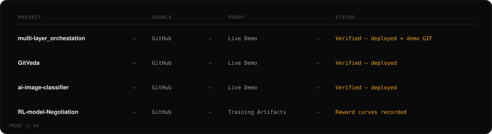
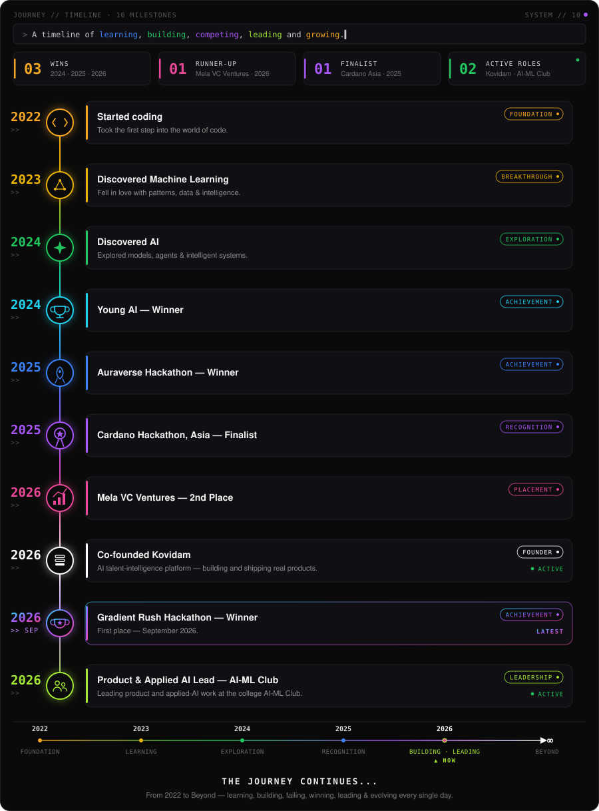

<div align="center">

# KARTIKEYA YADAV

### AI/ML ENGINEER · FOUNDER · SYSTEM BUILDER
**GENAI · AGENTIC AI · BACKEND · MACHINE LEARNING**

Building intelligent systems — from models, to agents, to products.

`● SYSTEM // 01`

</div>

<br>

## 01 · IDENTITY

I'm an AI/ML engineer and founder who builds systems end-to-end — the model, the agent-orchestration layer, the backend underneath, and the product wrapped around it. My work spans agentic orchestration platforms, explainable ML scoring systems, and reinforcement-learning research, alongside co-founding **Kovidam**, an AI talent-intelligence platform.

I care about systems that are architected, not just prompted — real backends, real data pipelines, real evaluation, shipped as working software.

<br>

## 02 · ENGINEERING ATLAS



<br>

## 03 · BUILDING — KOVIDAM

**Kovidam** — AI Talent Intelligence Platform
*Co-Founder & AI Engineer* · [kovidam.co.in](https://kovidam.co.in/)

```
KOVIDAM
├── AI INTERVIEW   →  kovidam-AI-Interview
│    Candidate evaluation platform for recruiters — FastAPI + Next.js,
│    Postgres/Redis, dockerized, Groq-powered interview generation.
│
└── SKILL GRAPH    →  Kovidam-Skill-Graph
     Explainable technical-hiring scoring — semantic shortlisting across
     GitHub / LeetCode / Codeforces signals, FastAPI + Alembic + React/Vite.
```

[`kovidam-AI-Interview →`](https://github.com/kartikeyajay2006/kovidam-AI-Interview) · [`Kovidam-Skill-Graph →`](https://github.com/kartikeyajay2006/Kovidam-Skill-Graph)

<br>

## 04 · FLAGSHIP SYSTEMS

#### multi-layer_orchestation — *Chakraview*
Agent-orchestration control plane — human-in-the-loop approval, RBAC, and audit/replay for agentic workflows.
`Next.js · Fastify · Postgres · Kafka · OpenAI`
[Source](https://github.com/kartikeyajay2006/multi-layer_orchestation) · [Live Demo](https://multi-layer-orchestation.vercel.app/)

---

#### agent--flow — *AgentFlow OS*
Multi-agent governance middleware — policy-driven risk tiers (low → critical) with tiered human approval across support, HR, finance, sales, and IT-ops agents.
`Next.js · FastAPI · PostgreSQL · Redis`
[Source](https://github.com/kartikeyajay2006/agent--flow)

<details>
<summary>Architecture notes</summary>
<br>

Agent actions are scored into LOW / MEDIUM / HIGH / CRITICAL risk tiers. LOW and MEDIUM auto-execute; HIGH requires one human approval; CRITICAL requires two. External connectors (Salesforce, Stripe, Workday, Jira, etc.) are explicitly documented as mocked in the current build — the value of the system is the governance layer itself, not live third-party integrations.

</details>

---

#### Kovidam-Skill-Graph
Explainable technical-hiring intelligence — semantic candidate scoring and shortlisting across coding-platform signals, with tenant-safe data isolation.
`FastAPI · Alembic · React · Vite · Firebase`
[Source](https://github.com/kartikeyajay2006/Kovidam-Skill-Graph)

---

#### kovidam-AI-Interview
AI interview and candidate-evaluation platform for recruiters — dockerized full stack with health-checked services.
`FastAPI · Next.js · PostgreSQL · Redis · Groq`
[Source](https://github.com/kartikeyajay2006/kovidam-AI-Interview)

---

#### RL-model-Negotiation — *DealForge*
Multi-agent reinforcement-learning framework for commercial negotiation — a Buyer agent trained against a Seller / Legal / Risk / Competitor agent organization.
`Python · GRPO / TRL · Qwen2.5-0.5B`
[Source](https://github.com/kartikeyajay2006/RL-model-Negotiation)

<details>
<summary>Architecture notes</summary>
<br>

Built on an OpenEnv-MCP-style environment (`env.py`, `reward_engine.py`, `agents.py`). Training results — reward curves and learning-efficiency plots — are recorded in the repository's `assets/readme/` directory.

</details>

---

#### GitVeda
Gamified Git-learning platform — a 30-level campaign with a live in-browser terminal for running real Git commands.
`React · Vite · Firebase`
[Source](https://github.com/kartikeyajay2006/GitVeda) · [Live Demo](https://git-veda-phi.vercel.app)

<br>

## 05 · PROJECTS

**AI-Video-Editor** — Whisper transcription with FFmpeg caption rendering and RNNoise-based audio denoising.
`FastAPI · Next.js` · [Source](https://github.com/kartikeyajay2006/AI-Video-Editor)

**Financial-Health-Score** — MSME credit scoring from alternate data (GST / UPI / EPFO signals); a hackathon-built full-stack system.
`React · FastAPI · scikit-learn` · [Source](https://github.com/kartikeyajay2006/Financial-Health-Score)

**blood-group-donor** — Blood-donor matching web app.
`React · Vite` · [Source](https://github.com/kartikeyajay2006/blood-group-donor)

**ai-image-classifier** — MobileNetV2-based image classifier served via Streamlit.
`Python · TensorFlow · Streamlit` · [Source](https://github.com/kartikeyajay2006/ai-image-classifier) · [Live Demo](https://ai-image-classifier-yw8jmptfdt64yxxyxprabj.streamlit.app/)

> **Web3 / Experimental** — `Cardano-BlockPhantom` is an early-stage blockchain risk-assessment experiment (Blockfrost / Alchemy client scaffolding). It's not production-ready and isn't shown as a system above; the related competition result is listed under Expeditions. [Source](https://github.com/kartikeyajay2006/Cardano-BlockPhantom)

<br>

## 06 · PROOF



<br>

## 07 · EXPEDITIONS

| Year | Expedition | Result |
|---|---|---|
| 2024 | Young AI | Winner |
| 2025 | Auraverse Hackathon | Winner |
| 2025 | Cardano Hackathon, Asia | Finalist |
| 2026 | Mela VC Ventures | Runner-up (2nd Place) |

<br>

## 08 · STACK DNA

**PROGRAMMING**
Python · Java · JavaScript · SQL

**AI / ML**
Machine Learning · Deep Learning · Generative AI · LLMs · NLP · Computer Vision · Reinforcement Learning

**AGENTIC AI**
AI Agents · Agentic Systems · LangChain · LangGraph · RAG · Multi-Agent Systems

**DATA / ML TOOLING**
NumPy · Pandas · Scikit-learn · TensorFlow · Matplotlib

**BACKEND**
FastAPI · Flask · SQLAlchemy · REST APIs

**DATABASE / DATA INFRASTRUCTURE**
PostgreSQL · MongoDB · Redis · Kafka

**WEB**
HTML · CSS · React · Next.js · Tailwind CSS · Node.js

**INFRASTRUCTURE / TOOLS**
Docker · AWS · Linux · Git · GitHub · CI/CD

<br>

## 09 · ENGINEERING JOURNEY



<br>

## 10 · CREDENTIALS

**Education**
B.Tech, Computer Science Engineering — Scaler School of Technology, in partnership with BITS Pilani

**Certifications**
AWS Cloud Practitioner (2025) · Google AI Essentials (2025)

<br>

## 11 · CURRENTLY EXPLORING

Agentic AI · Multi-Agent Systems · LLM Applications · RAG · AI Evaluation · Reinforcement Learning · AI Reliability · Backend / Distributed Systems

<br>

## 12 · CONTACT

<div align="center">

[GitHub](https://github.com/kartikeyajay2006) · [Portfolio](https://kartikeya-portfolio-rx7w.vercel.app/) · [LinkedIn](https://www.linkedin.com/in/kartikeya2006/) · [Kovidam](https://kovidam.co.in/) · [Email](mailto:kartikeya2006jay@gmail.com)

`● SYSTEM // END`

</div>
