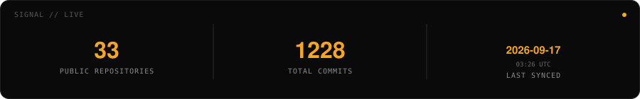

<div align="center">

<sub>[ PORTFOLIO ](https://kartikeya-portfolio-rx7w.vercel.app/) &nbsp;·&nbsp; [ KOVIDAM ](https://kovidam.co.in/) &nbsp;·&nbsp; [ LINKEDIN ](https://www.linkedin.com/in/kartikeya2006/) &nbsp;·&nbsp; [ GITHUB ](https://github.com/kartikeyajay2006)</sub>



<br>



<sub>Synced automatically by GitHub Actions — on every push, and every 6 hours on schedule. Not a static number.</sub>

<br>



<sub>Real contribution data, redrawn every 6 hours. The trail traces actual commit days — not a random animation.</sub>

</div>

<br>

<table>
<tr>
<td width="25%"><a href="#02-identity"><code>02</code> IDENTITY</a></td>
<td width="25%"><a href="#03-systems-i-build"><code>03</code> SYSTEMS</a></td>
<td width="25%"><a href="#04-engineering-atlas"><code>04</code> ATLAS</a></td>
<td width="25%"><a href="#05-building-kovidam"><code>05</code> KOVIDAM</a></td>
</tr>
<tr>
<td><a href="#06-flagship-systems"><code>06</code> FLAGSHIP</a></td>
<td><a href="#07-selected-projects"><code>07</code> PROJECTS</a></td>
<td><a href="#08-engineering-impact"><code>08</code> IMPACT</a></td>
<td><a href="#09-stack-dna"><code>09</code> STACK</a></td>
</tr>
<tr>
<td><a href="#10-engineering-journey"><code>10</code> JOURNEY</a></td>
<td><a href="#11-currently-exploring"><code>11</code> EXPLORING</a></td>
<td><a href="#12-credentials--honors"><code>12</code> HONORS</a></td>
<td><a href="#13-contact"><code>13</code> CONTACT</a></td>
</tr>
</table>

<table>
<tr>
<td width="33%" valign="top">

<sub>NOW // BUILDING</sub><br>
**Co-Founder &amp; AI Engineer**<br>
[Kovidam](https://kovidam.co.in/) — AI talent intelligence

</td>
<td width="33%" valign="top">

<sub>NOW // LEADING</sub><br>
**Product &amp; Applied AI Lead**<br>
AI-ML Club, Scaler School of Technology

</td>
<td width="33%" valign="top">

<sub>LATEST // WIN</sub><br>
**Gradient Rush Hackathon — Winner**<br>
September 2026

</td>
</tr>
</table>

<br>

## 02 Identity

<sub>SYSTEM // 02</sub>



<sub>SYSTEM STATUS, VERIFIED, CODE VOLUME, and ACTIVITY are computed live from the GitHub API on each sync — everything else is design, not a data claim.</sub>

<br>

## 03 Systems I Build

<sub>SYSTEM // 03</sub>

<table>
<tr><td>

**◆ 01 · Intelligent Systems**
Explainable scoring, evidence-grounded retrieval, and AI-driven decision systems.
[`Kovidam-Skill-Graph`](https://github.com/kartikeyajay2006/Kovidam-Skill-Graph) · [`kovidam-AI-Interview`](https://github.com/kartikeyajay2006/kovidam-AI-Interview) · [`Multimodal-RAG-Pipeline`](https://github.com/kartikeyajay2006/Multimodal-Data-Management-Pipeline-for-RAG-Ready-Systems) · [`Financial-Health-Score`](https://github.com/kartikeyajay2006/Financial-Health-Score)

</td></tr>
<tr><td>

**● 02 · Agentic Systems**
Multi-agent orchestration, governance, policy-driven automation, and sovereign on-prem AI.
[`AEGIS-workbench`](https://github.com/kartikeyajay2006/Sovereign-On_Premise-Agentic-AI-Workbench) · [`multi-layer_orchestation`](https://github.com/kartikeyajay2006/multi-layer_orchestation) · [`agent--flow`](https://github.com/kartikeyajay2006/agent--flow) · [`governance-B2A`](https://github.com/kartikeyajay2006/Multimodel-governance-B2A)

</td></tr>
<tr><td>

**▲ 03 · ML / Data Systems**
Model training, reinforcement learning, multimodal data pipelines, and applied ML.
[`RL-model-Negotiation`](https://github.com/kartikeyajay2006/RL-model-Negotiation) · [`Multimodal-RAG-Pipeline`](https://github.com/kartikeyajay2006/Multimodal-Data-Management-Pipeline-for-RAG-Ready-Systems) · [`ai-image-classifier`](https://github.com/kartikeyajay2006/ai-image-classifier)

</td></tr>
<tr><td>

**■ 04 · Backend Systems**
APIs, services, and data infrastructure underneath the systems above.
[`kovidam-AI-Interview`](https://github.com/kartikeyajay2006/kovidam-AI-Interview) · [`agent--flow`](https://github.com/kartikeyajay2006/agent--flow) · [`governance-B2A`](https://github.com/kartikeyajay2006/Multimodel-governance-B2A) · [`my-localmcp`](https://github.com/kartikeyajay2006/my-localmcp)

</td></tr>
<tr><td>

**◇ 05 · AI Products &amp; Developer Tools**
End-to-end products and developer tools with a real interface on top.
[`jky-terminal`](https://github.com/kartikeyajay2006/jky-terminal) · [`GitVeda`](https://github.com/kartikeyajay2006/GitVeda) · [`AI-Video-Editor`](https://github.com/kartikeyajay2006/AI-Video-Editor) · [`AI-Businesses`](https://github.com/kartikeyajay2006/AI-Businesses)

</td></tr>
</table>

<br>

## 04 Engineering Atlas

<sub>SYSTEM // 04</sub>


<br>

## 05 Building Kovidam

<sub>SYSTEM // 05</sub>

<table>
<tr>
<td width="220" align="center">

### KOVIDAM
**AI Talent Intelligence Platform**
<sub>Co-Founder &amp; AI Engineer</sub>

[kovidam.co.in →](https://kovidam.co.in/)

</td>
<td>

```
KOVIDAM
├── AI INTERVIEW  →  kovidam-AI-Interview
└── SKILL GRAPH   →  Kovidam-Skill-Graph
```

**[`kovidam-AI-Interview`](https://github.com/kartikeyajay2006/kovidam-AI-Interview)** — candidate evaluation platform for recruiters. Dockerized full stack, Groq-powered interview generation.
    

**[`Kovidam-Skill-Graph`](https://github.com/kartikeyajay2006/Kovidam-Skill-Graph)** — explainable technical-hiring scoring, semantic shortlisting across coding-platform signals.
    

</td>
</tr>
</table>

<br>

## 06 Flagship Systems

<sub>SYSTEM // 06</sub>



<table>
<tr>
<td width="50%" valign="top">

**◉ AEGIS**<br>
<sub>`N.01` · AGENTIC SYSTEM · On-Prem Workbench</sub>

     

Sovereign, on-premise agentic AI workbench — private documents in, a verified, human-signed, hash-chained answer out. **Understand → Decide → Execute → Prove**, entirely on one machine.

<details>
<summary>Architecture notes</summary>
<br>

Documents (scans included, via a local vision model) become evidence units that keep their source, page and section. Each stage is routed to a model that policy permits *and* the host can hold in memory — installed ≠ authorised. Generated code runs in a resource-limited subprocess with socket primitives neutralised, figures are recomputed rather than trusted, a human signs off, and every audit record carries the hash of the one before it. Inference runs through Ollama over loopback — no outbound calls at runtime.

</details>

[Source](https://github.com/kartikeyajay2006/Sovereign-On_Premise-Agentic-AI-Workbench)

</td>
<td width="50%" valign="top">

**◉ multi-layer_orchestation**<br>
<sub>`N.02` · AGENTIC SYSTEM · Chakraview</sub>

    

Agent-orchestration control plane — human-in-the-loop approval, RBAC, and audit/replay for agentic workflows.

[Source](https://github.com/kartikeyajay2006/multi-layer_orchestation) · [Live Demo](https://multi-layer-orchestation.vercel.app/)

</td>
</tr>
<tr>
<td width="50%" valign="top">

**◉ agent--flow**<br>
<sub>`N.03` · AGENTIC SYSTEM · AgentFlow OS</sub>

   

Multi-agent governance middleware — policy-driven risk tiers (low → critical) with tiered human approval across support, HR, finance, sales, and IT-ops agents.

<details>
<summary>Architecture notes</summary>
<br>

Agent actions are scored into LOW / MEDIUM / HIGH / CRITICAL risk tiers. LOW and MEDIUM auto-execute; HIGH requires one human approval; CRITICAL requires two. External connectors (Salesforce, Stripe, Workday, Jira, etc.) are explicitly documented in the repo as mocked — the value of the system is the governance layer itself, not live third-party integrations.

</details>

[Source](https://github.com/kartikeyajay2006/agent--flow)

</td>
<td width="50%" valign="top">

**◉ Multimodal Evidence Console**<br>
<sub>`N.04` · INTELLIGENT SYSTEM · RAG</sub>

      

Multimodal data pipeline for RAG-ready systems — video, audio, images, and PDFs become a provenance-grounded knowledge graph you can chat with. Every answer links to the exact video second or PDF page it came from.

<details>
<summary>Architecture notes</summary>
<br>

Each modality stays a first-class, timestamped, page-numbered observation and is cross-linked to the others instead of being flattened into text chunks. Chats are scoped per topic to exactly what was uploaded into them. The repo includes an evaluation of the multimodal graph against a flat-text RAG baseline.

</details>

[Source](https://github.com/kartikeyajay2006/Multimodal-Data-Management-Pipeline-for-RAG-Ready-Systems) · [Live Demo](https://frontend-sigma-murex-82.vercel.app/)

</td>
</tr>
<tr>
<td width="50%" valign="top">

**◉ Kovidam Platform**<br>
<sub>`N.05` `N.06` · INTELLIGENT SYSTEMS · Kovidam</sub>

      

The two systems behind Kovidam: **Skill-Graph** — explainable technical-hiring scoring and semantic shortlisting across coding-platform signals, with tenant-safe data isolation; **AI-Interview** — AI interview and candidate evaluation for recruiters on a dockerized, health-checked stack. Full breakdown in [05 Building Kovidam](#05-building-kovidam).

[Skill-Graph](https://github.com/kartikeyajay2006/Kovidam-Skill-Graph) · [AI-Interview](https://github.com/kartikeyajay2006/kovidam-AI-Interview) · [kovidam.co.in](https://kovidam.co.in/)

</td>
<td width="50%" valign="top">

**◉ RL-model-Negotiation**<br>
<sub>`N.07` · ML SYSTEM · DealForge</sub>

   

Multi-agent reinforcement-learning framework for commercial negotiation — a Buyer agent trained against a Seller / Legal / Risk / Competitor agent organization.

<details>
<summary>Architecture notes</summary>
<br>

Built on an OpenEnv-MCP-style environment (`env.py`, `reward_engine.py`, `agents.py`). Training results — reward curves and learning-efficiency plots — are recorded in the repository's `assets/readme/` directory.

</details>

[Source](https://github.com/kartikeyajay2006/RL-model-Negotiation)

</td>
</tr>
<tr>
<td width="50%" valign="top">

**◉ JKY Terminal**<br>
<sub>`N.08` · DEV TOOLING · Desktop</sub>

    

Local-first, persistent AI terminal — shells outlive the window, trusted command output becomes interactive views, and an approval-first assistant sits beside your work. Linux · macOS · Windows.

<details>
<summary>Architecture notes</summary>
<br>

A background supervisor (`jky-detach`) keeps long-running jobs alive across window closes; rejoining a pane restores the missed buffer. Deterministic Rust recognizers turn `docker`, `git`, `ps`, `df`, and `ls` output into interactive cards — no LLM in that path. Security model: *the window can ask, only Rust can act* — logic lives in 19 Rust crates and the frontend CSP enforces `connect-src 'self'`. The repo reports 2,229 frontend and 1,089 Rust tests.

</details>

[Source](https://github.com/kartikeyajay2006/jky-terminal)

</td>
<td width="50%" valign="top">

**◉ GitVeda**<br>
<sub>`N.09` · AI PRODUCT · Developer Learning</sub>

  

Gamified Git-learning platform — a 30-level campaign with a live in-browser terminal for running real Git commands.

[Source](https://github.com/kartikeyajay2006/GitVeda) · [Live Demo](https://git-veda-phi.vercel.app)

</td>
</tr>
</table>

<br>

## 07 Selected Projects

<sub>SYSTEM // 07</sub>

<table>
<tr>
<td width="50%" valign="top">

**AI-Video-Editor**<br>
   <br>
Whisper transcription with FFmpeg caption rendering and RNNoise-based audio denoising.<br>
[Source](https://github.com/kartikeyajay2006/AI-Video-Editor)

</td>
<td width="50%" valign="top">

**Multimodel-governance-B2A**<br>
    <br>
Business-to-agent governance backend — finance, legal, risk, and DevOps agents behind a policy engine, an audit chain, usage billing, and a message-bus dispatcher.<br>
[Source](https://github.com/kartikeyajay2006/Multimodel-governance-B2A)

</td>
</tr>
<tr>
<td width="50%" valign="top">

**Financial-Health-Score**<br>
  <br>
MSME credit scoring from alternate data (GST / UPI / EPFO signals) — a hackathon-built full-stack system.<br>
[Source](https://github.com/kartikeyajay2006/Financial-Health-Score)

</td>
<td width="50%" valign="top">

**AI-Businesses**<br>
  <br>
AI merchant copilot for local businesses — camera-based inventory recognition, a digital credit ledger (khata), and real-time sales telemetry.<br>
[Source](https://github.com/kartikeyajay2006/AI-Businesses)

</td>
</tr>
<tr>
<td width="50%" valign="top">

**my-localmcp**<br>
  <br>
Local-first MCP server giving AI coding agents deterministic, budget-aware repository context via SQLite FTS5 and optional Ollama re-ranking.<br>
[Source](https://github.com/kartikeyajay2006/my-localmcp)

</td>
<td width="50%" valign="top">

**ai-image-classifier**<br>
  <br>
MobileNetV2-based image classifier served via Streamlit.<br>
[Source](https://github.com/kartikeyajay2006/ai-image-classifier) · [Live Demo](https://ai-image-classifier-yw8jmptfdt64yxxyxprabj.streamlit.app/)

</td>
</tr>
<tr>
<td width="50%" valign="top">

**Agentra-Website**<br>
    <br>
Team-built cinematic agency site — a motion-driven Next.js front end on a Prisma-backed data layer, plus a standalone 3D interactive showcase page.<br>
[Source](https://github.com/kartikeyajay2006/Agentra-Website) · [Live Demo](https://agentra-website-chi.vercel.app)

</td>
<td width="50%" valign="top">

**blood-group-donor**<br>
 <br>
Blood-donor matching web app.<br>
[Source](https://github.com/kartikeyajay2006/blood-group-donor)

</td>
</tr>
</table>

> **Web3 / Experimental** — [`Cardano-BlockPhantom`](https://github.com/kartikeyajay2006/Cardano-BlockPhantom) is an early-stage blockchain risk-assessment experiment (Blockfrost / Alchemy client scaffolding). It's not production-ready, so it isn't shown as a system above — the related competition result is listed in the Engineering Journey timeline.

<details>
<summary><strong>Other work</strong> — coursework, challenges, and smaller experiments</summary>
<br>

- [`2nd-Year-MERN-P_S`](https://github.com/kartikeyajay2006/2nd-Year-MERN-P_S) — backend-engineering labs: ShopKart JWT auth service, React client, and product catalogue (MERN)
- [`kartikeya-portfolio`](https://github.com/kartikeyajay2006/kartikeya-portfolio) — personal portfolio site · [live](https://kartikeya-portfolio-rx7w.vercel.app/)
- [`Math-EDA`](https://github.com/kartikeyajay2006/Math-EDA) — math and exploratory-data-analysis notebooks
- [`Linux-Lab-Assignment-BITS`](https://github.com/kartikeyajay2006/Linux-Lab-Assignment-BITS) — BITS Pilani OS lab coursework
- [`codecrafters-shell-java`](https://github.com/kartikeyajay2006/codecrafters-shell-java) — CodeCrafters "Build Your Own Shell" challenge (Java)
- [`bits-cli-assignment`](https://github.com/kartikeyajay2006/bits-cli-assignment) — CLI coursework
- [`Scaler-1st-Year-Assignments`](https://github.com/kartikeyajay2006/Scaler-1st-Year-Assignments) — HTML/CSS practice pages
- [`Scaler-OSC-Projects`](https://github.com/kartikeyajay2006/Scaler-OSC-Projects) — beginner coursework
- [`Reinforce_Club-SST`](https://github.com/kartikeyajay2006/Reinforce_Club-SST) — RL club exercise (PCA / t-SNE)
- [`Full-Agentic-AI-basics-to-advance-`](https://github.com/kartikeyajay2006/Full-Agentic-AI-basics-to-advance-) — LLM / embeddings / structured-output learning snippets
- [`Student-Dost`](https://github.com/kartikeyajay2006/Student-Dost) — small student-help web app · [live](https://student-dost.vercel.app)
- [`Weather-App`](https://github.com/kartikeyajay2006/Weather-App) — weather lookup app · [live](https://weather-app-self-projects4.vercel.app)
- [`Soundboard`](https://github.com/kartikeyajay2006/Soundboard) — simple soundboard · [live](https://soundboard-six-phi.vercel.app)

</details>

<br>

## 08 Engineering Impact

<sub>SYSTEM // 08</sub>



<sub>Every number above is computed live from the GitHub API on each sync — not a self-reported statistic.</sub>

<br>

## 09 Stack DNA

<sub>SYSTEM // 09</sub>

<table>
<tr>
<td width="50%" valign="top">

**LANGUAGES**


</td>
<td width="50%" valign="top">

**AI / ML**


</td>
</tr>
<tr>
<td width="50%" valign="top">

**GENAI / AGENTIC**


</td>
<td width="50%" valign="top">

**BACKEND**


</td>
</tr>
<tr>
<td width="50%" valign="top">

**DATABASE / INFRASTRUCTURE**


</td>
<td width="50%" valign="top">

**WEB / DESKTOP**


</td>
</tr>
<tr>
<td colspan="2">

**CLOUD / ENGINEERING**


</td>
</tr>
</table>

<br>

## 10 Engineering Journey

<sub>SYSTEM // 10</sub>


<br>

## 11 Currently Exploring

<sub>SYSTEM // 11</sub>

           

<br>

## 12 Credentials & Honors

<sub>SYSTEM // 12</sub>

**Education**
B.Tech, Computer Science Engineering — Scaler School of Technology, in partnership with BITS Pilani

**Leadership**<br>
Product &amp; Applied AI Lead — AI-ML Club, Scaler School of Technology<br>
Co-Founder &amp; AI Engineer — [Kovidam](https://kovidam.co.in/)

**Honors**

| When | Competition | Result |
|:--|:--|:--|
| Sep 2026 | Gradient Rush Hackathon | **Winner** |
| 2026 | Mela VC Ventures | **2nd Place** |
| 2025 | Auraverse Hackathon | **Winner** |
| 2025 | Cardano Hackathon, Asia | **Finalist** |
| 2024 | Young AI | **Winner** |

**Certifications**
 

<br>

## 13 Contact

<sub>SYSTEM // 13</sub>

<div align="center">



<br><br>

[](https://github.com/kartikeyajay2006)
[](https://kartikeya-portfolio-rx7w.vercel.app/)
[](https://www.linkedin.com/in/kartikeya2006/)
[](https://kovidam.co.in/)
[](mailto:kartikeya2006jay@gmail.com)

</div>
